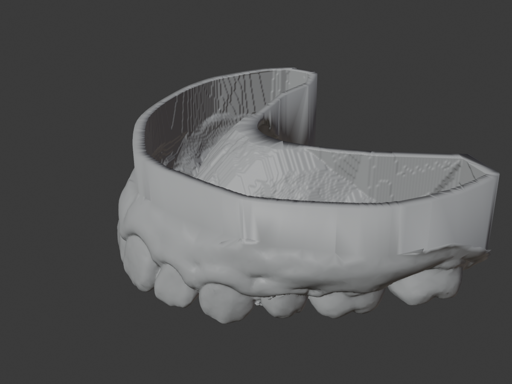

# dental-3d — 歯科スキャンから中空オープン模型を自動生成

口腔内スキャン（STL）から、3Dプリント用の **中空・オープン底の歯科模型** を1コマンドで生成します。歯/歯肉のAI分割、口蓋カットの平滑化、土台付け、中空化までを自動化。



```bash
python3 skills/blender-dental/pipeline/run_pipeline.py \
  --in SCAN.stl --out model.stl --arch upper \
  --repo model/ModelSegmentator_min
```

## できること

- 歯/歯肉をAI（PointNet2）で自動分割
- 口蓋カットラインを放物線フィットで滑らかに（歯は削らない安全策つき）
- 咬合平面を自動認識して垂直な土台を付与
- ブーリアン方式で中空化（外形ディテールを保持・watertight）／底を開放

## セットアップ

詳しい手順（環境構築〜実行）は **Note記事** にまとめています 👉 （ここにNote記事URL）

最短手順:

```bash
git clone https://github.com/e-MARU-Circle/dental-3d.git
cd dental-3d
pip install -r requirements.txt
python3 skills/blender-dental/pipeline/run_pipeline.py --in 入力.stl --out 出力.stl --arch upper --repo model/ModelSegmentator_min
```

## AIスキルとして使う（自然言語で操作）

本リポジトリは **AIエージェント用スキル**（`skills/blender-dental/SKILL.md`）としてパッケージ化されています。Anthropic の Agent Skills / プラグイン形式に対応するAIツール（**Claude Code**、デスクトップの **Cowork**、その他互換エージェント）に取り込むと、コマンドを覚えなくても自然言語で操作できます。

```
（AIに対して）
「このスキャンSTLから上顎の中空オープン模型を作って」
→ AIが run_pipeline を実行し、模型STLを出力します
```

導入方法（Claude Code / Cowork）:

1. プラグイン設定で、このリポジトリ（`https://github.com/e-MARU-Circle/dental-3d`）をマーケットプレイスとして追加
2. プラグイン `dental-3d` を有効化
3. あとはチャットで指示するだけ

スキルを使わず、**素のCLI**として任意の環境・自動化（cron 等）から直接呼ぶこともできます（上記「セットアップ」のコマンド）。AIスキルとCLIは同じ `run_pipeline.py` を共有しているので、どちらで動かしても結果は同一です。

## 同梱物

- `skills/blender-dental/` … AIスキル本体。`SKILL.md`＋パイプライン（`pipeline/run_pipeline.py` ほか）＋ Blender 歯牙ライブラリ運用スクリプト
- `model/ModelSegmentator_min/` … 歯/歯肉分割の学習済みモデル（推論用・最小セット）
- `.claude-plugin/` … プラグイン定義（AIツールへ取り込むためのメタ情報）

## 学習モデルについて

同梱の重み（`ckpts/stage1_last.pth`）は、一般に公開されているデータセットを用いて、著者自身が学習・作成したものです。研究・教育目的で公開します。**臨床診断を保証するものではありません**。利用は自己責任でお願いします。なお、利用元データセットのライセンス条件（出典明記・非商用など）にも従ってください。

## ライセンス

- コード: MIT License（`LICENSE`）
- 学習済みモデル: 研究・教育目的での利用可。商用利用・再学習での再配布時は出典明記をお願いします。

## 寄付のお願い 🙏

本プロジェクトは個人開発です。今後の研究・モデル改良の資金にあてるため、寄付を募っています。もしお役に立てたら、Note記事下部の「サポート」から応援いただけると励みになります 👉 （ここにNote記事URL）

## 謝辞

PointNet2 ほかOSSコミュニティ、3D歯科研究の先行研究に感謝します。
